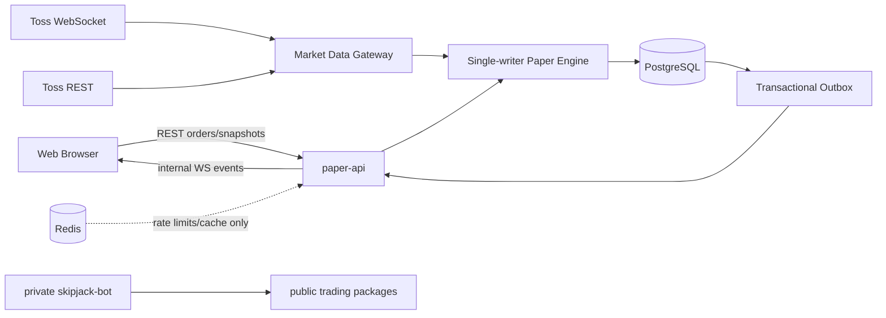

# Skipjack 실시간 가상투자 아키텍처 설계

- 작성일: 2026-08-21
- 상태: 대화형 설계 승인 완료, 문서 검토 요청
- 대상 저장소: `skipjack` 공개 모노레포
- 후속 저장소: `skipjack-bot` 비공개 개인 실거래 봇

## 1. 요약

Skipjack은 토스증권 Open API의 국내·미국 주식 시세를 이용하는 서버 권위형 실시간 가상투자 서비스다. 비회원 사용자는 익명 세션으로 KRW 10,000,000의 초기 자산을 받고, KRW/USD 지갑과 가상 환전을 이용해 시장가·지정가·스탑·익절·OCO 주문을 낼 수 있다. 가상 체결 엔진은 실제 호가 깊이를 사용해 부분 체결과 슬리피지를 계산하지만 거래소 큐 순서나 가상 사용자의 주문이 실제 시장에 미치는 영향은 모사하지 않는다.

공개 `skipjack`은 웹 UI, 가상투자 API, 거래 도메인 코어, 토스 시세 게이트웨이와 `PaperBroker`를 포함한다. 실제 계좌 주문, 계좌 식별자, 실거래 전략과 리스크 정책은 별도의 비공개 `skipjack-bot`에만 둔다. 의존 방향은 항상 `skipjack-bot -> skipjack 공개 패키지`다.

설계의 가장 중요한 제약은 토스 WebSocket 시세가 LOSSY이고 유실 감지용 sequence와 구독 직후 초기 스냅샷을 제공하지 않는다는 점이다. 따라서 Skipjack은 누락 이벤트를 추정하거나 소급 체결하지 않는다. 장애 중에는 거래를 멈추고, REST 최신 현재가와 호가를 새 기준으로 삼아 결정적으로 복구한다.

## 2. 목표와 비목표

### 2.1 목표

- 로그인 없이 바로 체험할 수 있는 서버 권위형 가상투자 포트폴리오를 제공한다.
- 국내와 미국 주식에 동일한 거래 도메인 모델을 적용한다.
- 현금, 예약 자산, 포지션, 주문과 체결을 PostgreSQL 트랜잭션으로 일관되게 유지한다.
- 시장가·지정가·스탑·익절·OCO와 호가 기반 부분 체결·슬리피지를 제공한다.
- 시세 장애, 프로세스 종료, 중복 요청과 동시 주문에서도 유령 체결과 이중 체결을 방지한다.
- 공개 거래 코어를 향후 비공개 실거래 봇에서 재사용할 수 있게 한다.
- 장애 상태와 가상 체결 근거를 사용자와 운영자가 설명 가능하게 만든다.

### 2.2 비목표

- 거래소 주문 큐 위치와 실제 체결 우선순위 재현
- 가상 사용자의 주문으로 실제 호가 잔량을 전역 소진시키는 시장 충격 모델
- 신용, 레버리지, 공매도, 파생상품과 소수점 주식
- 실계좌 주문 또는 실거래용 `TossBroker`의 공개 저장소 포함
- 계정 복구, 소셜 로그인, 리더보드와 사용자 간 거래
- MVP에서 모든 국내·미국 종목의 실시간 거래
- MVP에서 전체 분산 추적, 틱 전체 영구 저장과 완전한 이벤트 소싱

## 3. 제품 범위

### 3.1 익명 세션

- 첫 방문 시 서버가 256비트 이상의 불투명 세션 토큰을 발급한다.
- 브라우저는 토큰을 `HttpOnly`, `Secure`, `SameSite=Lax` 쿠키로 보관하고 서버는 토큰 해시만 저장한다.
- 세션 생성 시 KRW 10,000,000과 USD 0의 지갑을 한 번만 생성한다.
- 세션은 마지막 활동 후 30일 동안 유효하다. 쿠키를 잃으면 포트폴리오를 복구할 수 없다.
- 만료 시 미체결 주문을 취소하고 예약 자산을 해제한다. 만료 30일 후 세션과 포트폴리오 식별 데이터를 삭제한다. 가명화된 감사 이벤트는 최대 90일 보존한다.
- 쓰기 요청은 Origin 검증과 CSRF 토큰을 요구한다.

### 3.2 종목 범위와 시장 세션

- 종목 검색과 기본 정보 조회는 토스 REST API가 제공하는 전체 국내·미국 종목을 대상으로 한다.
- 실시간 가상매매는 운영자가 버전 관리하는 화이트리스트로 제한한다.
- MVP 기본 화이트리스트는 국내 40종목과 미국 40종목이다.
- 시장별 WebSocket 연결 하나를 사용한다. 한 종목은 체결과 호가 두 topic을 사용하므로 연결당 80 topic을 사용하고 20 topic의 운영 여유를 남긴다.
- 화이트리스트에서 종목을 제거하려면 먼저 해당 종목을 `CANCEL_ONLY`로 전환하고 active leg를 모두 해소해야 한다. active leg가 남은 종목을 바로 제거할 수 없다.
- MVP 체결은 각 시장의 정규 세션에서만 활성화한다. 장외 시간에는 지정가·조건부 주문을 접수하고 자산을 예약할 수 있지만 체결과 조건 발동은 다음 정규 세션까지 보류한다. 시장가 주문은 `MARKET_CLOSED`로 거부한다.
- 시장 캘린더와 세션 상태는 토스 REST 시장 정보로 갱신하고 DB에 캐시한다.

토스 연결 제약의 기준 문서는 다음과 같다.

- [토스증권 Open API 문서 인덱스](https://developers.tossinvest.com/llms.txt)
- [토스증권 WebSocket AsyncAPI](https://openapi.tossinvest.com/openapi-docs/latest/asyncapi.json)
- [토스증권 REST OpenAPI](https://openapi.tossinvest.com/openapi-docs/latest/openapi.json)

### 3.3 지갑과 가상 환전

- KRW와 USD 지갑을 분리하고 통화가 다른 주문 사이에서 자산을 자동 차감하지 않는다.
- 가상 환전은 서버가 발급한 10초 유효 quote를 사용하며 quote에 환율, 원금, 수령액과 만료 시각을 포함한다.
- MVP 환전 수수료는 0이며 사용자가 확인한 quote의 환율을 그대로 적용한다.
- 환전, 두 지갑 갱신과 감사 이벤트는 한 DB 트랜잭션으로 커밋한다.
- 환율을 가져오지 못하거나 quote가 만료되면 환전을 거부한다.

### 3.4 주문과 체결

- 수량은 양의 정수 주식 수다.
- 금액, 가격, 환율과 수수료 계산에서 JavaScript 부동소수점 `number`를 사용하지 않는다. DB `numeric`과 임의 정밀도 decimal 타입을 사용하고 API에서는 decimal string을 교환한다.
- 시장가는 현재 유효한 호가 깊이에서 즉시 체결 가능한 수량만 체결하고 잔량은 `IOC_REMAINDER` 사유로 취소한다.
- 지정가는 지정 가격보다 불리하게 체결되지 않는다. 현재 호가로 체결되지 않은 잔량은 미체결 상태로 남는다.
- 시장가는 IOC, 지정가·스탑·익절·OCO는 사용자가 취소하거나 익명 세션이 만료될 때까지 유지되는 GTC다.
- 스탑과 익절의 정상 발동 기준은 서버가 실제로 관측한 체결 가격이다. 발동 후 시장가 또는 지정가 실행 정책을 주문에 저장한다.
- OCO는 하나의 예약 그룹과 두 leg를 가진다. 한 leg의 발동·체결과 sibling 취소는 같은 트랜잭션에서 수행한다.
- 동일 recovery snapshot에서 두 OCO 조건이 동시에 참으로 평가되면 손실 제한 역할의 stop leg를 우선한다.
- 각 가상 주문은 다른 사용자의 가상 주문과 독립적으로 호가 깊이를 소비한다. 여러 사용자의 총 가상 체결량이 실제 호가 잔량을 넘을 수 있음을 제품 설명에 명시한다.
- 모든 체결에는 사용한 호가 레벨, 체결 수량, 수수료, 슬리피지, 가격 모델 버전과 market-data epoch를 기록한다.
- 수수료와 세금은 시장별 versioned `FeeModel` 설정으로 계산한다. 서비스는 설정 없는 시장에서 시작하지 않으며 요율 변경 시 새 버전을 감사한다. 테스트는 명시적인 요율 fixture를 사용한다.

## 4. 저장소와 컴포넌트 경계

### 4.1 공개 모노레포

공개 저장소는 pnpm workspace와 Turborepo를 사용한다.

```text
skipjack/
├── apps/
│   ├── web/                 # React/TypeScript 사용자 UI
│   └── paper-api/           # 장기 실행 API, 시세 연결, 가상 체결
├── packages/
│   ├── trading-core/        # 주문, 체결, 지갑, 예약, 불변식
│   ├── market-data/         # 정규화 타입과 Toss 시세 게이트웨이 계약
│   └── strategy-sdk/        # 공개 전략 및 Broker 계약
└── docs/
```

공개 패키지의 npm scope 이름은 배포 식별자일 뿐 아키텍처 계약이 아니다. 공개 패키지 배포는 코어 API가 안정화된 뒤 수행하며 비공개 봇은 semver range가 아니라 정확한 버전을 pin한다.

### 4.2 비공개 실거래 저장소

`skipjack-bot`에는 다음만 둔다.

- 실제 주문을 전송하는 `TossBroker`
- 실제 OAuth 토큰과 계좌 식별자
- 실거래 전략과 파라미터
- 실거래 리스크 한도와 reconciliation
- 실계좌 kill switch와 배포 설정

공개 저장소에는 실거래 계좌를 선택하거나 실제 주문을 전송하는 실행 경로를 만들지 않는다. 공개 `Broker` 계약과 `PaperBroker`만 제공한다.

### 4.3 런타임 구성



- PostgreSQL은 주문, 자산, 안전 incident, 감사와 outbox의 유일한 권위 상태다.
- Redis는 rate limit, 짧은 캐시와 비권위 fan-out에만 사용한다. Redis 유실로 거래 상태가 사라지면 안 된다.
- 시세 게이트웨이는 토스 원본을 공개 코어의 정규화된 `MarketTrade`와 `OrderBook`으로 변환한다.
- 시장별 execution leader 하나만 호가 이벤트를 적용하고 체결을 생성한다.
- 웹은 토스 API나 토스 토큰에 직접 접근하지 않는다.

초기 배포는 장기 WebSocket과 고정 egress IP를 지원하는 VM의 `paper-api`, 관리형 PostgreSQL, 별도 웹 호스팅을 전제로 한다. 앞서 검토한 Vercel, Oracle과 Supabase 조합은 비용 가설이며 배포 직전에 가격·제한·가용성을 다시 확인한다. 공급자 선택은 도메인 정확성에 영향을 주지 않게 한다.

## 5. 핵심 도메인 모델

### 5.1 주요 엔터티

- `anonymous_sessions`: 토큰 해시, 상태, 생성·만료·마지막 활동 시각
- `wallets`: 세션, 통화, total, available, reserved, version
- `positions`: 세션, 종목, total quantity, available quantity, reserved quantity, average cost, version
- `orders`: 주문 유형, side, 가격 조건, 수량, 체결량, 상태, market-data epoch, version
- `oco_groups`: 두 leg, 공유 예약, winner leg, 상태, version
- `fills`: 주문, 가격, 수량, 수수료, 슬리피지, 체결 근거, `recoveryFill`
- `reservations`: 주문 또는 OCO 그룹에 귀속된 현금·주식 예약
- `idempotency_requests`: 세션·키, request hash, 완료 응답과 상태 코드
- `safety_incidents`: 범위, 원인, 차단 capability, epoch, fencing token, version, 상태
- `audit_events`: 불변 거래·운영 감사 이벤트
- `outbox_events`: 커밋된 사용자 이벤트의 전달 큐
- `market_data_state`: 시장·종목 health, recovery epoch, 내부 market-data version

### 5.2 주문 상태

```text
RECEIVED
  -> REJECTED
  -> OPEN
  -> PENDING_TRIGGER

PENDING_TRIGGER
  -> TRIGGERED
  -> CANCELLED
  -> EXPIRED

TRIGGERED
  -> OPEN
  -> FILLED
  -> CANCELLED

OPEN
  -> PARTIALLY_FILLED
  -> FILLED
  -> CANCELLED
  -> EXPIRED

PARTIALLY_FILLED
  -> PARTIALLY_FILLED
  -> FILLED
  -> CANCELLED
  -> EXPIRED
```

- `FILLED`, `CANCELLED`, `EXPIRED`, `REJECTED`는 terminal 상태며 다시 활성화되지 않는다.
- 시장가의 일부 체결 후 잔량 취소는 최종 `CANCELLED` 상태와 양수 `filledQuantity`, `IOC_REMAINDER` 사유로 표현한다.
- OCO 그룹은 `ACTIVE -> RESOLVED`로만 전이하며 winner leg를 한 번만 설정할 수 있다.
- 모든 상태 변경은 기대 `version`이 일치할 때만 성공한다.

### 5.3 예약 규칙

- `wallet.total = wallet.available + wallet.reserved`
- `position.total = position.available + position.reserved`
- 현금과 포지션의 세 값은 음수가 될 수 없다.
- 매수 지정가는 남은 수량 × limit price + 예상 수수료를 예약한다.
- 시장가와 조건부 시장가 매수는 최신 기준 가격에 서버 가격 보호 상한을 적용한 최대 체결 금액과 예상 수수료를 예약한다.
- 발동 시 필요한 현금이 예약 금액을 초과하면 가격 보호를 위반한 것으로 보고 체결하지 않고 주문을 `CANCELLED` 처리한다.
- 매도 주문은 남은 수량만큼 position을 예약한다.
- OCO는 두 leg의 합이 아니라 가능한 최대 노출 한 번만 예약한다. 매도 OCO는 공유 수량을 한 번만 예약한다.
- 생성, 정정, 부분 체결, 취소, 만료와 OCO 해소가 예약량을 정확히 해제하거나 이동해야 한다.
- 신용과 공매도가 없으므로 예약 후 available 자산을 넘는 주문은 거부한다.

### 5.4 거래 불변식

- 한 주문의 전체 fill 수량은 주문 수량을 넘지 않는다.
- OCO에서는 최대 한 leg만 발동·체결될 수 있다.
- 자산 변화는 체결 대금, 수수료와 환전 원장의 합과 일치한다.
- KRW 체결은 KRW 지갑만, USD 체결은 USD 지갑만 변경한다.
- 완료되거나 취소된 주문은 프로세스 재시작 후에도 다시 활성화되지 않는다.
- 동일한 idempotency 요청은 최대 하나의 주문 또는 환전만 생성한다.
- 오래된 recovery epoch나 fencing token의 이벤트는 주문 상태를 변경할 수 없다.
- 거래 변경과 그 transactional audit·outbox 이벤트는 함께 커밋되거나 함께 롤백된다.

## 6. 주요 데이터 흐름

### 6.1 주문 제출

1. API가 익명 세션, CSRF, 화이트리스트, 시장 세션과 입력을 검증한다.
2. `(anonymousSessionId, idempotencyKey)`를 확인하고 canonical request hash를 비교한다.
3. 안전 capability gate를 고정 순서로 shared lock한다.
4. effective incident, market-data freshness와 로컬 emergency latch를 확인한다.
5. 계정 지갑·포지션과 OCO 그룹을 잠그고 available 자산을 확인한다.
6. 주문과 예약을 만들고 즉시 가능한 체결을 계산한다.
7. 주문·fill·wallet·position·reservation·audit·outbox·idempotency response를 한 트랜잭션으로 커밋한다.
8. outbox publisher가 at-least-once로 사용자 이벤트를 전달한다. 클라이언트는 `eventId`로 중복 제거한다.

### 6.2 멱등성

- unique key는 `(anonymous_session_id, idempotency_key)`다.
- 같은 key와 같은 request hash는 최초의 HTTP 상태 코드와 body를 그대로 재현한다.
- 같은 key와 다른 request hash는 `409 IDEMPOTENCY_CONFLICT`다.
- 성공과 deterministic 비즈니스 거부 응답은 idempotency record와 함께 트랜잭션으로 저장한다. 거래 상태가 바뀌는 응답은 그 거래 변경과 같은 트랜잭션에 둔다.
- DB 트랜잭션에 진입하지 못한 `503`, 연결 실패와 rate-limit 응답은 저장하지 않아 같은 key로 안전하게 재시도할 수 있다.
- 동시에 도착한 같은 key 요청은 DB unique constraint와 트랜잭션 대기로 하나만 실행된다.
- 완료된 idempotency record는 최소 24시간 보존한다.

### 6.3 정상 시세 처리

- Toss trade event는 조건부 주문의 trigger 입력이다.
- Toss orderbook event는 체결 가격과 가능한 수량의 입력이다.
- 각 시장은 하나의 execution leader와 single-writer event loop를 가진다.
- 정규화 이벤트에 `recoveryEpoch`, `leaderFencingToken`, 내부 `marketDataVersion`, `receivedAt`과 원천 timestamp를 붙인다.
- 원천 timestamp가 null일 수 있으므로 최신성의 유일한 근거로 사용하지 않는다.
- 이벤트 loop는 symbol별 순서를 결정하고 DB 체결 트랜잭션 전에 최신 안전 gate를 다시 확인한다.

### 6.4 브라우저 동기화

- `paper-api`는 자체 사용자 이벤트 스트림에 세션별 단조 증가 `streamSequence`를 부여한다.
- `streamSequence`는 outbox transaction에서 할당하고 `(anonymousSessionId, streamSequence)` unique constraint로 보호한다.
- 브라우저는 sequence gap을 발견하면 주문·지갑·포지션 snapshot을 다시 요청한다.
- 시세 표시 이벤트는 DB outbox에 저장하지 않는 비권위 스트림이며 `recoveryEpoch`와 `marketDataVersion`을 전달한다. 시세 스트림 gap에서는 해당 종목의 최신 market snapshot을 다시 받는다.
- 브라우저 상태는 편의 캐시이며 서버 snapshot과 DB가 권위 상태다.
- 시장 데이터 health와 주문 차단 원인을 API와 UI에 노출한다.

## 7. LOSSY 시세와 복구

### 7.1 감지 원칙

- 토스 피드에는 유실 감지 sequence가 없으므로 개별 중간 프레임 유실을 완전하게 감지할 수 있다고 주장하지 않는다.
- WebSocket close, PING/PONG 실패와 구독 거절은 transport incident를 만든다.
- 연결은 60초 간격으로 PING을 보내며 close 또는 2회 연속 PONG 실패를 transport incident로 처리한다.
- 종목 이벤트가 오래됐다는 이유만으로 시장 전체를 장애 처리하지 않는다. 낮은 유동성이나 변경 없는 호가도 이벤트가 없을 수 있다.
- 종목 데이터가 주문 판단 허용 나이를 넘으면 REST freshness probe를 실행한다. REST도 실패하거나 데이터가 유효하지 않을 때 해당 종목 incident를 만든다.
- 시장 캘린더와 거래 세션 밖에서는 이벤트 부재를 장애로 보지 않는다.

### 7.2 health 상태

```text
HEALTHY -> DEGRADED -> RECOVERING -> HEALTHY
                    \-> DEGRADED
```

- `DEGRADED`: 신규·정정·매칭·조건 발동 차단, DB가 정상일 때 취소 허용
- `RECOVERING`: 새 epoch로 기준 상태를 만드는 중이며 거래 차단 유지
- `HEALTHY`: 필요한 구독, 기준 시세와 불변식이 모두 유효

### 7.3 복구 절차

1. 시장 incident를 만들고 execution과 신규 주문을 중지한다.
2. execution leader가 PostgreSQL lease를 획득하고 새 fencing token과 recovery epoch를 발급한다.
3. 이전 epoch의 메모리·큐 이벤트를 폐기한다.
4. 시장의 정확한 체결·호가 topic 목록을 선언하고 ACK를 검증한다.
5. rate-limited REST 호출로 화이트리스트 종목의 최신 현재가와 orderbook을 가져온다. snapshot 복구가 실패한 종목에는 별도 symbol incident를 유지한다.
6. REST 현재가는 조건이 지금도 충족되는지 판단하고 orderbook은 실행 가격과 수량을 결정한다.
7. 각 symbol baseline을 원자적으로 교체하고 이후 새 epoch 이벤트만 적용한다.
8. transport ACK와 안정화 5초를 통과하면 market transport incident를 해제한다. 각 symbol incident는 그 종목의 snapshot과 불변식 검사를 통과한 뒤 별도로 CAS 해제한다.
9. 5분 동안 3회 복구 실패하면 자동 재개를 중단하고 운영자 확인을 요구한다.

### 7.4 복구 체결 의미론

- 장애 구간의 누락 tick, 고가·저가 또는 호가 경로를 추정하지 않는다.
- 조건 가격을 장애 중 통과했다가 복구 시점에 되돌아온 주문은 발동하지 않는다.
- 복구 시점에도 조건이 참이면 최신 REST 현재가로 trigger하고 최신 orderbook으로 체결한다.
- 복구 체결은 `recoveryFill=true`, incident, epoch와 기준 시세를 감사 이벤트에 기록한다.
- 이 한계를 사용자 주문 화면과 장애 배너에 명시한다.

## 8. 동시성과 선형화

### 8.1 잠금 순서

모든 거래와 안전 incident 변경은 다음 순서로 PostgreSQL gate를 획득한다.

```text
global -> market -> symbol -> account -> OCO group/order -> wallet/position
```

- 주문·정정·취소·체결은 적용 scope의 shared gate를 커밋까지 보유한다.
- incident 활성화·해제는 해당 scope의 exclusive gate를 커밋까지 보유한다.
- incident 트랜잭션 커밋이 차단 효력의 선형화 시점이다. 이미 shared gate를 보유한 거래는 먼저 커밋하거나 롤백된다.
- 고정 잠금 순서를 어기는 코드는 허용하지 않는다.
- OCO winner 지정, sibling 취소, fill과 예약 해제는 같은 트랜잭션이다.

### 8.2 리더 lease와 fencing

- 시장별 execution leader는 전용 PostgreSQL 연결의 advisory lock과 영속 leader epoch를 사용한다.
- 전용 연결이 끊기면 해당 프로세스는 즉시 로컬 matching latch를 닫는다.
- 새 leader는 더 큰 fencing token을 발급받는다.
- 모든 fill 트랜잭션은 현재 token과 epoch가 일치할 때만 커밋된다.
- 이전 leader가 늦게 처리한 이벤트는 DB에서 거부된다.

## 9. 운영 안전장치

### 9.1 원인별 incident

scope당 한 행을 덮어쓰지 않고 장애 원인마다 독립 incident를 추가한다. incident는 다른 원인으로 덮어쓰거나 함께 지우지 않으며, 자기 상태만 기대 version과 epoch를 사용한 CAS로 `ACTIVE -> RESOLVED` 전이한다. 활성화와 해제는 각각 immutable audit event를 남긴다.

필수 필드는 다음과 같다.

- `incidentId`, `scopeType`, `scopeId`
- `source`, `causeCode`, `reason`
- 차단 capability 집합
- `recoveryEpoch`, `ownerFencingToken`, `version`
- `activatedAt`, `resolvedAt`, `resolvedBy`
- `ACTIVE`, `RESOLVED` 상태

해제는 정확한 `incidentId + version + recoveryEpoch` CAS가 성공할 때만 가능하다. effective 권한은 적용 가능한 모든 active incident가 허용하는 capability의 교집합이다. scope의 폭 자체는 우선순위가 아니다.

### 9.2 capability matrix

| 표시 상태 | 신규·정정 | 사용자 취소 | 매칭·조건 발동 | 운영 복구 |
| --- | --- | --- | --- | --- |
| `NORMAL` | 허용 | 허용 | 허용 | 허용 |
| `CANCEL_ONLY` | 차단 | 허용 | 차단 | 허용 |
| `READ_ONLY` | 차단 | 차단 | 차단 | 허용 |
| `UNAVAILABLE` | 차단 | 불가능 | 차단 | 제한적 |

- 피드 장애는 `CANCEL_ONLY` capability를 만든다.
- 특정 계정의 자산·OCO 불변식 위반은 해당 계정 `READ_ONLY` incident를 만든다.
- 같은 유형의 불변식 위반이 여러 계정에서 반복되면 global `READ_ONLY`를 만든다.
- DB나 transactional audit가 불능이면 상태를 영속할 수 없으므로 `UNAVAILABLE`로 응답한다.
- 사용자가 안전하게 취소할 수 있다고 약속하는 것은 DB와 감사 쓰기가 모두 정상일 때뿐이다.
- kill switch는 resting order를 자동 취소하지 않는다. cancel-all은 별도의 명시적·멱등 운영 명령이다.

### 9.3 fail-closed

- DB, audit 또는 치명적 불변식 오류를 발견한 각 프로세스는 원자적 로컬 emergency latch를 즉시 닫는다.
- latch가 닫히면 DB 조회 전에도 신규·정정·체결을 `503 SERVICE_UNAVAILABLE`로 차단한다.
- 가능한 경우 DB incident를 함께 기록하지만 기록 성공을 차단의 전제로 삼지 않는다.
- 관리자 status·복구 control plane은 거래 gate와 별도 경로와 작은 전용 DB pool을 사용한다.
- 감사 기능이 복구되기 전에는 unaudited switch 해제를 허용하지 않는다.
- MVP는 단일 active execution process를 사용한다. 여러 API 인스턴스로 확장할 때도 DB gate와 fencing token이 최종 방어선이다.

### 9.4 자동 발동과 해제

- WebSocket 종료, 필수 구독 거절, 복구 실패: market `CANCEL_ONLY`
- 비정상 orderbook, 통화 불일치, 오래된 epoch: symbol `CANCEL_ONLY`
- 계정 불변식 위반: account `READ_ONLY`
- 감사 쓰기 또는 DB 정합성 실패: local `UNAVAILABLE`, 가능한 경우 global `READ_ONLY`
- 구독 용량 초과: 새 symbol admission만 거부하고 기존 주문은 유지
- transient 피드 incident만 자동 해제할 수 있다.
- 수동, 불변식, audit incident는 운영자 원인 확인과 명시적 해제가 필요하다.

### 9.5 시작, 종료와 배포

- 프로세스는 항상 로컬 `RECOVERING/CANCEL_ONLY`로 시작한다.
- 저장된 incident, 미체결 주문, 예약과 wallet/position 불변식을 복원한 뒤에만 거래를 연다.
- 정상 종료는 신규 주문을 먼저 막고 진행 중 트랜잭션과 outbox 커밋을 drain한다.
- 비정상 종료 후 새 프로세스는 동일한 recovery 절차를 수행한다.
- 40+40 구성이 계정의 두 WebSocket 연결을 모두 사용하므로 rolling 배포 중 세 번째 연결을 만들지 않는다.
- 배포는 `CANCEL_ONLY -> 기존 연결 종료 -> 새 프로세스 연결·복구 -> NORMAL` handoff로 잠깐의 거래 중단을 명시적으로 허용한다.

### 9.6 용량과 오남용 제한

- 세션당 활성 executable leg는 최대 50개다. OCO는 두 leg, pending trigger도 한 leg로 계산한다.
- 세션별 주문 mutation은 초당 5회, burst 10회다.
- 취소는 별도 우선 lane에서 초당 10회, burst 20회다.
- IP별 주문 mutation은 초당 20회, burst 40회다.
- 전체 active leg는 10,000개를 넘을 수 없다.
- 세션 생성은 IP별 분당 5회, 일 100회로 제한한다.
- 제한은 버전이 있는 운영 설정이며 변경을 감사한다. 초기 공개 베타의 부하·오남용 메트릭으로 더 낮출 수 있다.
- invasive device fingerprint는 MVP에 사용하지 않는다.
- 서버 가격 보호 기본값은 검증된 mid price 대비 5%다. 범위를 넘는 market/conditional-market 체결은 실행하지 않고 명확한 사유로 취소한다.
- two-sided book이 없거나 crossed book이라 유효한 mid를 계산할 수 없으면 가격 보호를 우회하지 않고 해당 symbol을 `CANCEL_ONLY`로 전환한다.
- 전체 active-leg ceiling은 DB capacity row를 잠가 동시 admission에서도 초과하지 않게 한다.
- rate-limit 저장소가 불능이면 신규 세션·신규 주문·정정은 fail-closed한다. 취소는 프로세스 로컬 emergency limiter와 DB capacity gate를 사용해 계속 허용한다.

### 9.7 관리자 경로

- 관리자 API는 공개 인터넷에 노출하지 않고 SSH tunnel 또는 사설 네트워크에서만 접근한다.
- 짧은 만료의 관리자 credential과 IP allowlist를 요구한다.
- 활성화·해제·cancel-all은 idempotency key, actor, reason과 기대 version을 요구한다.
- Paper MVP에서는 2인 승인을 요구하지 않는다. 전역 release와 cancel-all의 2인 승인은 실거래 봇 또는 다중 운영자 단계에서 추가한다.

## 10. 오류 모델

모든 API 오류는 안정적인 `code`, 사용자용 `message`, `retryable`, 선택적 `retryAfter`와 `requestId`를 반환한다.

핵심 코드는 다음과 같다.

- `SYMBOL_NOT_TRADABLE`
- `MARKET_CLOSED`
- `MARKET_DATA_DEGRADED`
- `RECOVERY_IN_PROGRESS`
- `CANCEL_ONLY`
- `ACCOUNT_READ_ONLY`
- `SERVICE_UNAVAILABLE`
- `INSUFFICIENT_AVAILABLE_CASH`
- `INSUFFICIENT_AVAILABLE_POSITION`
- `PRICE_PROTECTION`
- `ORDER_STATE_CONFLICT`
- `IDEMPOTENCY_CONFLICT`
- `RATE_LIMITED`
- `CAPACITY_REACHED`

일시적 인프라 오류, recovery 상태와 rate limit만 `retryable=true`이며 가능한 경우 `retryAfter`를 제공한다. validation, 자산 부족, 상태 충돌과 가격 보호 거부는 요청 내용을 바꾸지 않는 한 재시도할 수 없다.

## 11. 관측성과 감사

### 11.1 거래 감사

- 주문, 체결, 예약, 지갑과 포지션 감사 이벤트는 비즈니스 변경과 같은 트랜잭션에서 append-only로 저장한다.
- 시스템 lifecycle incident는 짧은 독립 트랜잭션으로 기록한다.
- DB 자체가 불능이면 구조화 애플리케이션 로그에 실패를 남기고 거래를 fail-closed한다.
- correction은 기존 event를 수정하지 않고 새 event로 남긴다.
- audit table은 `occurred_at` 월별 range partition을 사용한다.
- 주요 인덱스는 `(order_id, occurred_at)`, `(anonymous_session_id, occurred_at DESC)`와 시간 범위 인덱스다.

`FILL_CREATED`와 `TRIGGERED`에는 다음 근거를 포함한다.

- 기준 trade price와 timestamp
- 사용한 orderbook level의 price·volume
- 계산된 fill, fee, slippage
- `recoveryEpoch`, 내부 `marketDataVersion`, leader fencing token
- 가격·수수료 모델 버전
- recovery fill 여부와 incident

토스 원천 sequence처럼 오해할 수 있는 `snapshotSyncSequence` 필드는 만들지 않는다.

### 11.2 애플리케이션 로그

- JSON 로그에 `requestId`, `orderId`, `idempotencyKeyHash`, `recoveryEpoch`, `market`, `symbol`, `healthState`, `errorCode`를 포함한다.
- OAuth token, 원본 익명 토큰과 실제 계좌 정보는 기록하지 않는다.
- 모든 tick을 로그에 남기지 않고 상태 전환, 오류와 체결 근거만 보존한다.
- 운영 로그 보존 기간은 14일이다.

### 11.3 메트릭

- `market_data_health{market,state}`: 현재 state만 1인 Gauge
- `feed_ping_latency_seconds`: Histogram
- `feed_reconnect_total`: Counter
- `recovery_duration_seconds`: Histogram
- `rest_snapshot_request_total{market,result}`: Counter
- `order_event_total{market,event_type,status}`: Counter
- `transaction_duration_seconds{tx_type}`: Histogram
- `db_lock_wait_seconds{lock_type}`: Histogram
- `invariant_violation_total{invariant_type,market}`: Counter
- `safety_incident_active{scope_type,cause_group}`: Gauge
- `emergency_latch_active`: Gauge

세션, 주문, idempotency key와 symbol은 metric label로 사용하지 않는다. 상세 추적은 로그와 audit에서 수행한다.

### 11.4 health endpoint와 경보

- `/health/live`: 프로세스 event loop 생존 여부
- `/health/ready`: DB와 필수 내부 컴포넌트 준비 여부
- `/health/market-data`: 시장·종목의 health와 차단 사유
- 시장 데이터 장애는 `/health/ready`를 실패시키지 않아 재시작 loop를 만들지 않는다.
- invariant 위반, transactional audit 실패, emergency latch와 수동 kill switch는 즉시 경보한다.
- 장중 `DEGRADED`, `RECOVERING` 고착, 반복 flapping, transaction 오류와 lock 대기는 지속 시간 기반으로 경보한다.
- 같은 market·incident·epoch의 경보를 deduplicate하고 해소 알림과 cooldown을 제공한다.
- 각 경보에는 `DEGRADED`, 복구 고착, 불변식 위반, audit 실패와 DB 장애 runbook을 연결한다.

### 11.5 초기 운영 목표

다음은 외부 SLA가 아니라 공개 베타의 초기 SLO다.

- 거래 mutation의 transactional audit 누락 0건
- 알려진 거래 불변식 위반 0건
- `HEALTHY` 상태 주문 mutation 응답 p95 500ms 이하
- `CANCEL_ONLY` 상태 취소 응답 p95 1초 이하
- WebSocket close는 즉시, PONG 누락은 120초 이내에 transport incident로 감지
- 일시적 피드 incident의 95%를 정규 세션 중 60초 이내 복구

SLO 미달은 정확성을 완화하는 근거가 아니라 용량을 낮추거나 거래 범위를 축소하는 신호로 사용한다.

## 12. 보안과 개인정보

- 토스 access token과 client secret은 `paper-api` 런타임 secret으로만 보관한다.
- 브라우저 bundle, 로그, audit와 공개 npm 패키지에 secret을 포함하지 않는다.
- 실제 계좌 credential은 공개 서비스와 저장소에 존재하지 않는다.
- API는 CORS allowlist, Origin 검증, CSRF, body size 제한과 입력 schema 검증을 적용한다.
- 익명 token은 원문 저장·로그를 금지하고 key rotation이 가능한 해시로 식별한다.
- 관리자와 사용자 API를 네트워크·credential·rate-limit 정책으로 분리한다.
- 감사 payload는 체결 설명에 필요한 최소 시장 데이터만 보존하고 개인정보를 넣지 않는다.

## 13. 테스트 전략

### 13.1 단위 및 상태 모델 테스트

- 주문 상태, 예약, 부분 체결, slippage, 수수료, 평균단가와 PnL
- KRW/USD 분리와 가상 환전
- OCO winner와 terminal 상태 불변성
- health, incident capability 합성, recovery epoch와 가격 보호
- virtual clock, deterministic adapter와 재현 가능한 seed 사용

### 13.2 property-based 테스트

- total = available + reserved
- 현금·포지션 비음수
- fill 합계가 주문량 이하
- OCO 최대 한 leg
- terminal 주문 재활성화 금지
- 통화 간 자산 침범 금지
- 동일 idempotency 요청의 결과·side effect 동일성
- 이벤트 순열과 프로세스 재시작 후에도 거래 불변식 유지

테스트 oracle은 프로덕션 계산 helper를 import하지 않는다. 이벤트 보존식과 손으로 계산한 KRW/USD golden value를 사용한다. PR은 고정 seed를 사용하고 실패 seed를 기록한다. seed 회전 탐색은 nightly hardening에 둔다.

### 13.3 계약 테스트

- 공식 OpenAPI·AsyncAPI 스키마 기반 fixture와 비식별 recorded payload를 함께 사용한다.
- no sequence, no initial snapshot, LOSSY, null timestamp와 unknown enum을 검증한다.
- full-replace subscription, ACK 일부 거절, PING/PONG, close와 backoff를 검증한다.
- fake adapter와 recorded replay adapter에 같은 conformance suite를 적용한다.
- fixture에 API 버전, 수집 시각과 출처를 기록한다.
- PR CI는 실제 토스 API를 호출하지 않는다. 제한된 수동 smoke lane만 live credential을 사용한다.

### 13.4 PostgreSQL 통합·동시성 테스트

- 실제 PostgreSQL을 사용해 트랜잭션 commit·rollback과 migration을 검증한다.
- 두 DB connection과 advisory lock/barrier로 fill-cancel, OCO dual trigger, idempotency 중복을 결정적으로 교차시킨다.
- shared 거래 gate와 exclusive incident gate의 activation race를 검증한다.
- serialization failure와 deadlock retry 후 최종 불변식을 검증한다.
- idempotency response replay와 다른 payload conflict를 검증한다.

### 13.5 장애와 재시작 테스트

- WebSocket close, PONG 누락, subscription 일부 거절과 flapping
- `DEGRADED`에서 신규·매칭·trigger 차단과 cancel 허용
- REST snapshot 실패와 recovery 재단절
- 장애 중 조건 통과 후 반등의 no-fill과 현재도 조건을 넘은 recovery fill
- 이전 epoch·fencing token 이벤트 거부
- fill transaction commit 직전·직후 프로세스 종료와 재시작
- 이미 완료된 주문의 재장전 방지
- audit insert 실패, DB 불능과 local emergency latch
- leader split-brain과 stale event

### 13.6 최소 E2E와 CI gate

fake market adapter로 다음 수직 흐름을 검증한다.

```text
익명 세션 -> 시세 -> 주문 -> 부분 체결 -> 지갑/포지션 -> 새로고침 snapshot 복원
```

장애 배너, 주문 차단, cancel-only, recovery fill 표시와 내부 stream gap 복구를 함께 검증한다. UI 테스트는 임의 timeout 대신 상태 endpoint와 결정적 이벤트 barrier를 기다린다.

PR 필수 gate는 단위, property, 계약, PostgreSQL 통합과 1~2개의 핵심 E2E다. 장시간 network flapping, seed 회전, schema drift 수집, DST와 장 경계, audit-only 상태 재구성과 chaos는 후속 hardening이다.

## 14. 구현 완료 기준

MVP는 다음 조건을 모두 만족할 때 완료로 본다.

- 새 익명 사용자가 초기 KRW 지갑을 받고 세션 재방문 시 같은 포트폴리오를 본다.
- 허용 종목에서 KRW/USD 환전과 시장가·지정가·스탑·익절·OCO가 동작한다.
- 부분 체결, 슬리피지, 예약 자산과 수수료가 독립 oracle 테스트를 통과한다.
- 동시 주문, OCO와 취소 race에서도 불변식이 유지된다.
- 피드 단절 시 신규 주문·매칭·조건 발동이 멈추고 안전한 취소만 허용된다.
- 복구가 과거 체결을 꾸며내지 않으며 최신 현재가·호가 기준으로만 재개된다.
- 프로세스 crash 전후에 중복 주문·체결과 terminal 주문 재활성화가 없다.
- 사용자 UI가 거래 불가 상태, 원인과 recovery fill을 설명한다.
- 감사 이벤트만으로 개별 주문의 승인, trigger, 체결, 예약과 취소 근거를 설명할 수 있다.
- 공개 저장소와 배포 산출물에 실거래 secret과 실제 주문 경로가 없다.

## 15. 단계적 확장

MVP 이후에는 다음 순서로 확장한다.

1. 공개 거래 코어의 API 안정화와 정확한 버전의 공개 패키지 배포
2. recorded market replay와 백테스트 도구
3. 비공개 `skipjack-bot`에서 shadow 실행
4. 공개 `PaperBroker`와 동일 전략 계약을 사용한 paper 검증
5. 비공개 reconciliation, 계좌 risk limit와 2인 승인 수준의 live safety 추가
6. 소액 canary live 후 제한적인 개인 live 운영

공개 가상투자와 개인 실거래 봇은 A/B 실험이 아니라 독립 배포·독립 DB·독립 secrets를 가진 투트랙 제품이다.

## 16. 저장소 위생

- 이 설계 문서 외 애플리케이션 파일은 설계 승인 전에 만들지 않는다.
- `.codegraph/`, `.cursor/`, `.omc/`는 환경 관리 파일로 현재 커밋에 포함하지 않는다.
- 구현 계획 승인 후에만 pnpm workspace와 Turborepo를 스캐폴딩한다.
